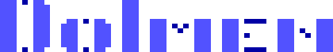

# 💫 dolmen - Olivier Mengué

Fluent in Go, SQL, OpenAPI, Perl 5, jq, C, bash,  JavaScript, Windows CMD...

Past languages: Raku, XSLT, Pascal, REBOL, i386 assembly...

## 🧠 Tech Stack

<!-- https://github.com/lelouchfr/skill-icons -->

### Languages  

  
  
  
  
  <!-- https://github.com/LelouchFR/skill-icons/issues/496 -->
  <!--
  
  -->
  
  
  
  
  

### Databases

  
  
  

### Development platforms & collaboration tools

  
  
  
  
  
  

### Deployment & production

  
  
  
  
  
  
  
  
  <!--
  
  -->
  
  

### Development tools

  
  
  
  
  

## Go projects

My activity in the Go ecosystem:
  * See [personal Go projects](https://github.com/orgs/dolmen-go/repositories?q=mirror%3Afalse+fork%3Afalse+archived%3Afalse) and forks on [dolmen-go](https://github.com/dolmen-go).
  * Co-maintainer of [Testify](https://pkg.go.dev/github.com/stretchr/testify), the early assertion library used by thousands of public projects. 24.000+ ⭐.

Contributions to the [Go project](https://go.dev):
  * [Merged contributions](https://go-review.googlesource.com/q/owner:olivier.mengue@gmail.com)
  * [Go language/stdlib proposals](https://github.com/golang/go/issues?q=is%3Aissue%20label%3AProposal%20author%3Adolmen)